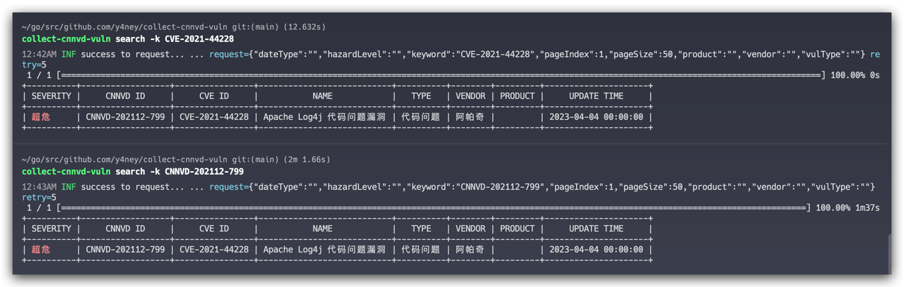

# collect-cnnvd-vuln （CNNVD 漏洞收集）


[](https://goreportcard.com/report/github.com/y4ney/collect-cnnvd-vuln)
[](https://app.fossa.com/projects/custom%2B37386%2Fgithub.com%2Fksoclabs%2Fkbom?ref=badge_shield)
[](https://bestpractices.coreinfrastructure.org/projects/7273)


collect-cnnvd-vuln 为非官方应用程序，可以自动化的查询、下载和订阅漏洞信息。

- 你是否想全面的了解CNNVD的数据信息？
- 你是否还在为无法收集和管理CNNVD漏洞数据而烦恼？
- 你是否已经厌倦了机械化的CNNVD数据查询流程？
- 你是否想为自己的漏洞扫描器中的漏洞增加更具本土化的画像？
- 你是否想拥有一个属于自己的漏洞情报助手？

关注这个项目，你将解答上述所有的问题。`collect-**-vuln`系列项目为威胁情报收集系列。
`collect-cnnvd-vuln` 为该系列的第一个项目，`collect-cnnvd-vuln` 收集到信息都上传至 [y4ney/cnnvd](https://github.com/y4ney/cnnvd)，可直接下载查看。
本项目只用于学习交流，不可用于危害他人利益。


# 0x01安装

# 0x02 使用
## 2.1 查看版本信息
```text
$ collect-cnnvd-vuln version
unknown version unknown
build date: unknown
commit: unknown

https://github.com/y4ney/collect-cnnvd-vuln
```
## 2.2 查看数据模型
使用 `schema` 命令，可以查看数据模型。 该项目所收集的数据主要有漏洞列表、漏洞详情、威胁等级、供应商信息、产品信息和漏洞类型 6 种。
```text
$ collect-cnnvd-vuln schema --help
打印 CNNVD 漏洞信息的json文件结构

Usage:
  collect-cnnvd-vuln schema [flags]

Flags:
  -h, --help          help for schema
  -t, --type string   指定数据类型(只支持 vuln-list, vuln-detail, hazard-level, vendor, product 和 vuln-type) (default "vuln-detail")

Global Flags:
  -v, --verbose   enable verbose logging (DEBUG and below)
```
若想知道数据的模型，只需使用 `-t` 来指定即可，默认会输出漏洞详情的数据模型。例如，若您想要获取漏洞列表的数据，请输入 `-t vuln-list`
```text
$ collect-cnnvd-vuln schema -t vuln-list
{
	"$schema": "https://json-schema.org/draft/2020-12/schema",
	"$id": "https://github.com/y4ney/collect-cnnvd-vuln/internal/model/record",
	"$ref": "#/$defs/Record",
	"$defs": {
		"Record": {
			"properties": {
				"id": {
					"type": "string"
				},
				"vulName": {
					"type": "string"
				},
				"cnnvdCode": {
					"type": "string"
				},
				"cveCode": {
					"type": "string"
				},
				"hazardLevel": {
					"type": "integer"
				},
				"createTime": {
					"type": "string"
				},
				"publishTime": {
					"type": "string"
				},
				"updateTime": {
					"type": "string"
				},
				"typeName": {
					"type": "string"
				},
				"vulType": {
					"type": "string"
				}
			},
			"additionalProperties": false,
			"type": "object"
		}
	}
}
```
## 0x03 搜索漏洞信息
使用 `search` 命令，可以搜索漏洞信息，该项目可搜索的信息包括漏洞信息、供应商信息和产品信息，默认会搜索漏洞信息。
该搜索功能均可使用 `-r` 来指定重试次数，默认为 `5` 次。

```text
$ collect-cnnvd-vuln search --help
搜索 CNNVD 漏洞信息

Usage:
  collect-cnnvd-vuln search [flags]

Flags:
      --hazard-level string   指定威胁等级，仅支持 超危、高危、中危和低危, 仅在 --type=vuln 时有效
  -h, --help                  help for search
  -k, --keyword string        指定搜索的关键词
      --page-index int        指定当前的页码，仅在 --type=vuln 时有效 (default 1)
      --page-size int         指定页数大小 仅在 --type=vuln 时有效 (default 50)
      --product string        指定商品编号，仅在 --type=vuln 时有效，请先通过 --type=product 来获取商品编号
  -r, --retry int             指定请求的重试次数 (default 5)
  -t, --type string           指定类型，仅支持 vuln, vendor 和 product (default "vuln")
      --vendor string         指定供应商编号，仅在 --type=vuln 时有效，请先通过 --type=vendor 获取供应商编号

Global Flags:
  -v, --verbose   enable verbose logging (DEBUG and below)
```
### 3.1 搜索供应商信息
若想要搜索供应商信息，请输入 `-t vendor`，若想要知道某位供应商的编号，需要输入 `-k [供应商名称]` ，若不使用 `-k` 指定关键词，默认会输出所有供应商的信息。
```text
$ collect-cnnvd-vuln search -t vendor -k 深信服
+---------+--------+
|  LABEL  | VALUE  |
+---------+--------+
| 1004810 | 深信服 |
+---------+--------+
```
### 3.2 搜索产品信息
若想要搜索产品信息，请输入 `-t product`，若想要知道某位产品的编号，需要输入 `-k [产品名称]` ，若不使用 `-k` 指定关键词，默认会输出所有供应商的信息。
```text
$ collect-cnnvd-vuln search -t product -k Tomcat
+-------+----------------------------+
| LABEL |           VALUE            |
+-------+----------------------------+
| 1365  | Apache Tomcat              |
+-------+----------------------------+
| 405   | Apache Tomcat JK Connector |
+-------+----------------------------+
```
### 3.3 搜索漏洞信息
由于 `search -t` 的默认值为 `vuln`，所以无需显式指定 `type` 类型
## 3.3.1 漏洞编号搜索
若想要知道某个CVE漏洞信息或CNNVD漏洞，需要输入 `-k [CVE编号/CNNVD编号]` ，若不使用 `-k` 指定关键词，默认会输出所有供应商的信息。
```text
$ collect-cnnvd-vuln search -k CVE-2021-44228
12:26AM INF success to request... ... request={"dateType":"","hazardLevel":"","keyword":"CVE-2021-44228","pageIndex":1,"pageSize":50,"product":"","vendor":"","vulType":""} retry=5
 1 / 1 [==========================================================================================================================================================] 100.00% 0s
+----------+------------------+----------------+---------------------------+----------+--------+---------+---------------------+
| SEVERITY |     CNNVD ID     |     CVE ID     |           NAME            |   TYPE   | VENDOR | PRODUCT |     UPDATE TIME     |
+----------+------------------+----------------+---------------------------+----------+--------+---------+---------------------+
| 超危      | CNNVD-202112-799 | CVE-2021-44228 | Apache Log4j 代码问题漏洞   | 代码问题  | 阿帕奇  |         | 2023-04-04 00:00:00 |
+----------+------------------+----------------+---------------------------+----------+--------+---------+---------------------+
```
如图所示，漏洞信息中的威胁等级是带颜色的，其中超危为深红色、高危为红色、中危为黄色、低危为蓝色、未知为灰色


## 贡献
TODO CONTRIBUTING
collect-cnnvd-vuln是Apache 2.0许可的，并通过GitHub拉取请求接受贡献。详情请参阅[CONTRIBUTING](CONTRIBUTING.md)
