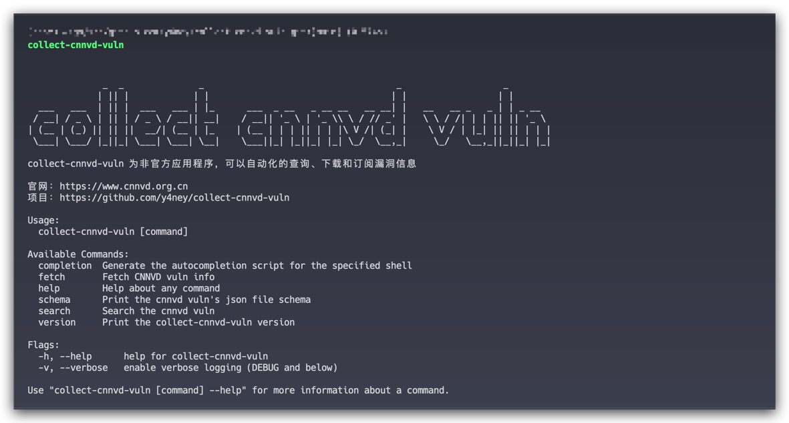
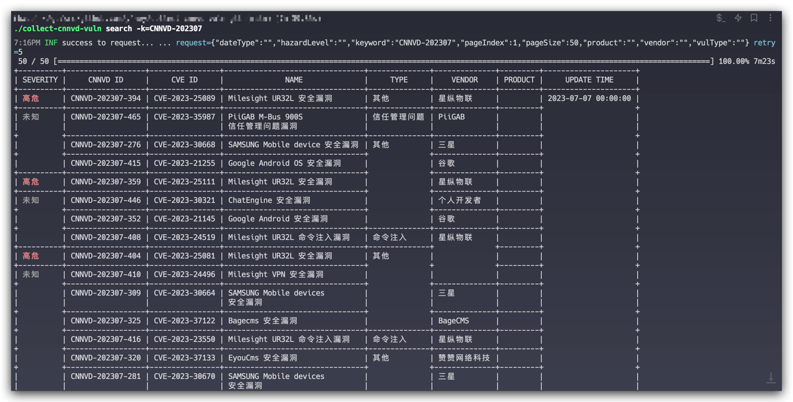

# collect-cnnvd-vuln
阿里云漏洞收集

## 快速开始

### 安装

### 使用

可选标志包括：

[//]: # (https://chat.openai.com/)
## 模型

## 贡献
TODO CONTRIBUTING
collect-cnnvd-vuln是Apache 2.0许可的，并通过GitHub拉取请求接受贡献。详情请参阅[CONTRIBUTING](CONTRIBUTING.md)
