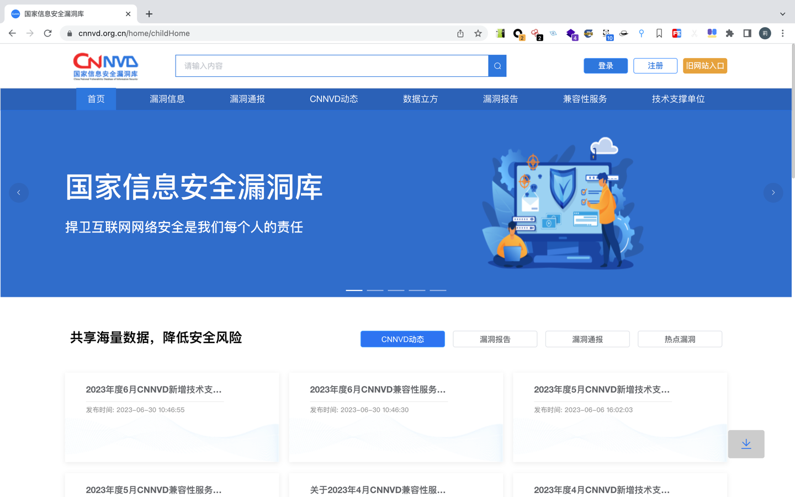
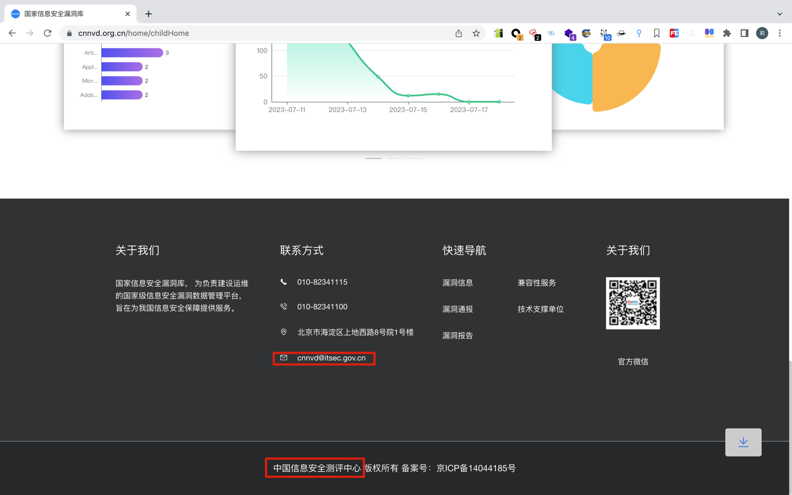
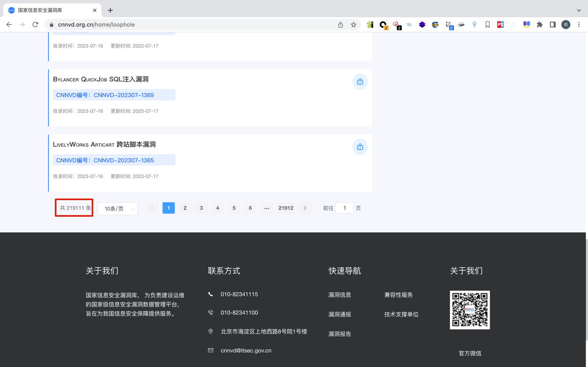
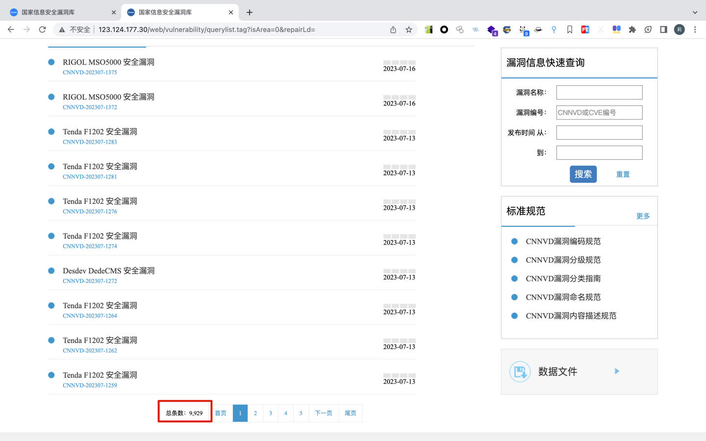
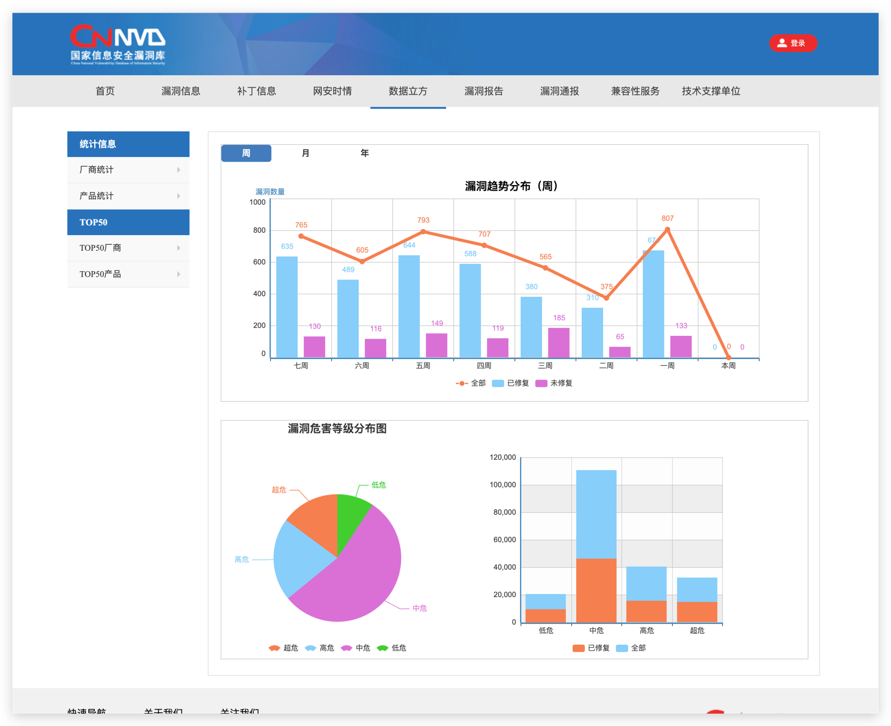
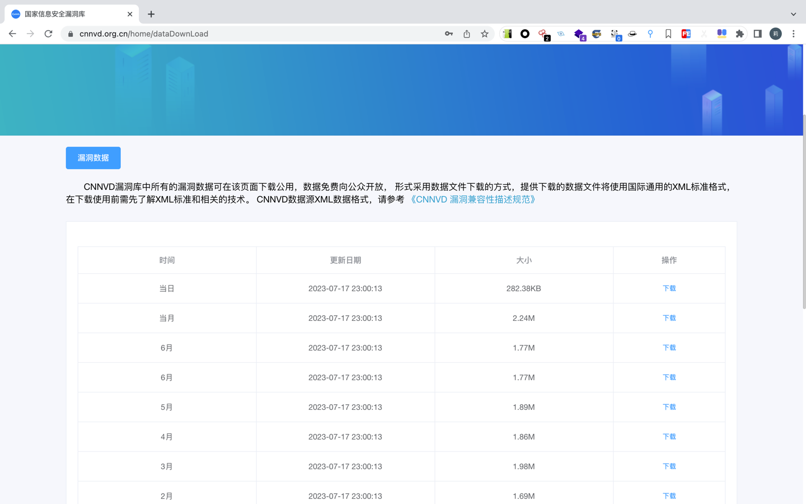
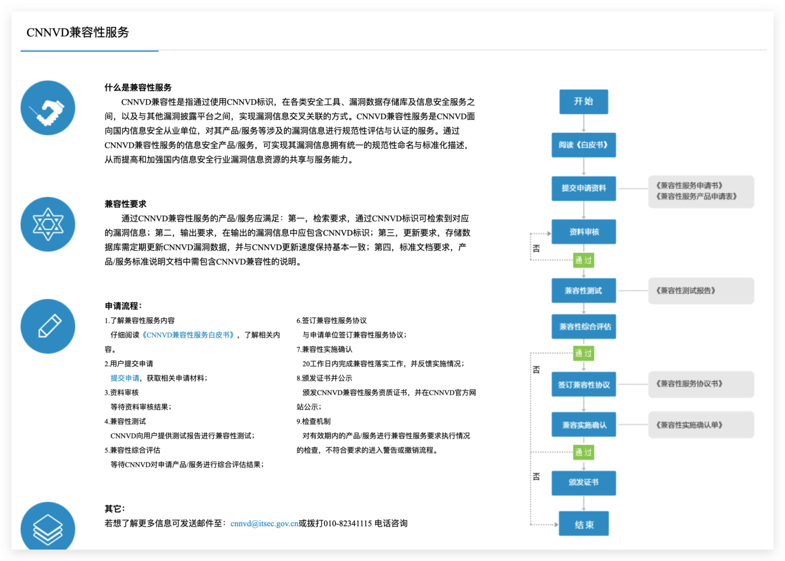

# 国家信息安全漏洞库（CNNVD）
新网站：http://www.cnnvd.org.cn/

旧网站：http://123.124.177.30/
## 0x00 简介

国家信息安全漏洞库，英文名称"China National Vulnerability Database of Information Security "简称"CNNVD"，于2009年10月18日正式成立，
是中国信息安全测评中心为切实履行漏洞分析和风险评估的职能，负责建设运维的国家信息安全漏洞库，面向国家、行业和公众提供灵活多样的信息安全数据服务，
为我国信息安全保障提供基础服务。

CNNVD是中国信息安全测评中心为切实履行漏洞分析和风险评估职能，在 **国家专项** 经费支持下，
负责建设运维的国家级信息安全漏洞数据管理平台，旨在为我国信息安全保障提供服务。

CNNVD通过自主挖掘、社会提交、协作共享、网络搜集以及技术检测等方式，联合政府部门、行业用户、安全厂商、高校和科研机构等社会力量，
对涉及国内外主流应用软件、操作系统和网络设备等软硬件系统的信息安全漏洞开展采集收录、分析验证、预警通报和修复消控工作，建立了规范的漏洞研判处置流程、
通畅的信息共享通报机制以及完善的技术协作体系，处置漏洞涉及国内外各大厂商上千家，涵盖政府、金融、交通、工控、卫生医疗等多个行业，
为我国重要行业和关键基础设施安全保障工作提供了重要的技术支撑和数据支持，对提升全行业信息安全分析预警能力，
提高我国网络和信息安全保障工作发挥了重要作用。

与CNVD不同的是，CNNVD是正式的国家官方漏洞库，维护团队也是官方正式人员。

## 0x02 数据分析

CNNVD采用的是CNNVD漏洞编号，约收录了219,111个漏洞(统计自2023年7月18日 11:19)，其中国内的有9,929个，国外的有209,180个

> 同一时间，旧网站显示有219,110个漏洞，但新网站显示有219,111个漏洞，原因未知。并且区分国内和国外的漏洞的规则未知，
> 我个人猜测国内的漏洞是国内的安全研究员报送的，国外的漏洞是从国外收录并翻译过来的，需要注意的是，
> 我们并不能认为国内漏洞就只有CNNVD编号而没有CVE编号。这两个问题并不会影响到项目的开发，
> 所以就没有深究到底，但也希望其他人可以了解相关情况，可以提供信息。

漏洞概览如下所示，通过饼图，我们得知漏洞的等级有4个，分别为超危、高危、中危和低危，需要注意的是，实际上CNNVD的漏洞等级还有 `未知`。
但是这个并不是多大的问题，因为若有漏洞被披露出来，在没有足够的资料的情况下，其漏洞等级为未知状态。但经过安全分析师分析过后，
威胁等级就会变成饼图中的安全等级。

根据规范文件猜测出来。CNNVD的漏洞兼容性标准规范很大程度上与NVD的相似，曾在一份文件中看到CNNVD的评分标准是按照CVSS2来的，
但不知道该文件现在是否还在实施。 若想对CNNVD的漏洞规范有更深入的认识，可以查看：http://123.124.177.30/web/wz/xgbz.tag

> 由于该网站为旧网站地址，所以我存了份快照（保存于2023年07月18日）

- [CNNVD漏洞编码规范](pdf/CNNVD漏洞编码规范.pdf)
- [CNNVD漏洞分级规范](pdf/CNNVD漏洞分级规范.pdf)
- [CNNVD漏洞分类指南](pdf/CNNVD漏洞分类指南.pdf)
- [CNNVD漏洞命名规范](pdf/CNNVD漏洞命名规范.pdf)
- [CNNVD漏洞内容描述规范](pdf/CNNVD漏洞内容描述规范.pdf)
- [CNNVD漏洞受影响实体描述规范](pdf/CNNVD漏洞影响实体描述规范.pdf)

对应的，我们可以通过本项目，获得一些额外的信息，据我所观察，产品信息和供应商信息基本上每天都有在更新，主要描述了某漏洞是哪位供应商的哪个产品的。
除此之外，我们还需达成一个简单的共识，即CNNVD漏洞的命名方式为： `CNNVD-[年][月]-[编号]`，其中年为4位整数，月为2位整数。

- [漏洞等级](https://github.com/y4ney/cnnvd/blob/main/hazard_level.json)
- [产品信息](https://github.com/y4ney/cnnvd/blob/main/product.json)
- [供应商信息](https://github.com/y4ney/cnnvd/blob/main/vendor.json)
- [漏洞类型信息](https://github.com/y4ney/cnnvd/blob/main/vuln_type.json)

## 0x03 数据获取方式
### 3.1 登录系统，下载XML数据
1. 要注册一个账号，然后登录账号
2. 进入 https://www.cnnvd.org.cn/home/dataDownLoad 进行下载。

该项目没有采取此获取方式，主要因为：
通过与该项目的数据模型对比发现，XML文件缺少 `相关链接` 和 `补丁链接` 字段的信息。但为什么会缺少，原因未知。

若想要获取XML文件的格式，需要先了解 [CNNVD 漏洞兼容性描述规范](https://www.cnnvd.org.cn/static/download/CNNVD_XML_Specification.pdf)，
这里也存了一份快照：

- [CNNVD 漏洞兼容性描述规范](./pdf/CNNVD漏洞兼容性描述规范.pdf)

### 3.2 自动化爬虫收集

话不多收，直接查看 [api 文档](./pdf/api.html)，这是该项目的获取方式。但这里需要说明，该项目没有开并发，
并且以后也不会开并发，毕竟不是特别合理的方式获取漏洞数据。
并且该项目有个超时机制，若访问超时，则随机等待一会再爬，若超时的次数越多，所需要等待的时间越多。

### 3.3 兼容性服务申请

该方式是最为推荐的企业级的获取方式。
- 对于个人而言，很正规，风险较小
- 对于企业而言，可以获得更灵活，更及时的服务，并且我大致看了一下流程，不需要收费，最后，还会颁发一个兼容性证书，这个对一个企业安全能力建设的一个肯定。
- 对于国家而言，更有利于我们国家的漏洞库的维护和安全能力的建设，漏洞库的建设就和网络协议一般，大家更看重的是标准化和规范化。 
若国家有在做这方面的工作，意味着网络安全上升到国家高度，与海陆空一样重要，每个民众都应该积极响应，共建网络安全强国！
